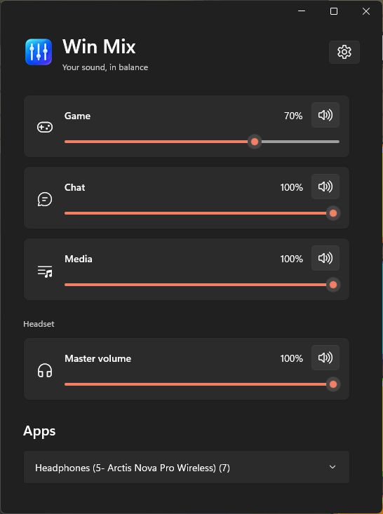

# Win Mix

Win Mix is a native Windows tray mixer for SteelSeries Sonar Gaming, Chat and Media outputs, plus a selected headset master output. It runs on Windows 10 version 2004 or newer, x64.

Download the per-user installer from the [latest release](https://github.com/tzachbon/win-mix/releases/latest). Releases include a SHA-256 checksum. The installer includes the application runtimes and does not require developer tools. Start with Windows is enabled on first installation; later installs preserve the existing choice. Uninstall from Windows Settings > Apps > Installed apps.

*Installed Win Mix 1.0.1 on Windows 11.*

## Controls

Hold **Left Ctrl + Left Alt** to show quick controls at the bottom center of the current monitor. The row is **Main, Game, Chat, Media**. Main controls the headset master output selected in Settings. Hover a channel or use Left/Right to select it; scroll or use Up/Down to change its volume by two percentage points; press M to toggle mute. Release either modifier or press Escape to hide the controls. Release both keys before starting another gesture.

The tray menu opens Mixer, Settings, or exits. Closing Mixer keeps Win Mix in the tray. Settings lets you choose a Windows output for each channel and the headset master, and control the startup option. A missing saved device remains unavailable until that same endpoint returns or you choose another one.

Win Mix controls Windows endpoint levels and active app-session levels. It does not change application routing. It does not integrate with a headset dial, ensure game-specific overlay compatibility, or synchronize Sonar's internal mixer. Levels come from Windows; muting preserves volume, and changing volume preserves mute. Settings store endpoint IDs and the selected quick-control channel, not audio levels.

This build is unsigned, so Windows may show a reputation warning.

## Updates

In Settings, **Check for updates** checks the latest stable GitHub release only when clicked. **Update to…** downloads and verifies the installer, shows installation progress, then reopens Settings with the new version. Downloads can be canceled. Settings and startup preferences are preserved. Development builds link to the release page instead of installing. Version 1.0.1 needs one normal installer upgrade to gain this button.

Updates use GitHub HTTPS release metadata, SHA-256, size and file-version checks. Installers remain unsigned. There are no automatic checks or background downloads. Failed downloads never launch; if the installer itself fails after closing Win Mix, use its error message and reopen the app or rerun the installer.

## Support

Use the [GitHub issue templates](https://github.com/tzachbon/win-mix/issues/new/choose) for ordinary bug reports and feature requests. Do not post credentials, device IDs, personal paths, or unredacted diagnostics. Report suspected vulnerabilities privately using the instructions in [SECURITY.md](SECURITY.md).

For local settings and error-file locations and redaction guidance, see [Diagnostics](CONTRIBUTING.md#diagnostics).

## Development

See [CONTRIBUTING.md](CONTRIBUTING.md) for the pinned SDK, checks, installer prerequisites, source map, and audio-probe safety. The project is distributed under the [GNU GPL v3.0](LICENSE) (`GPL-3.0-only`); third-party notices are in [Licenses](Licenses/).

## Release

See [contributing and releasing](docs/releases.md) for PR title rules, versioning, the paused release pipeline, and recovery. `VERSION` is the application and installer version source.
