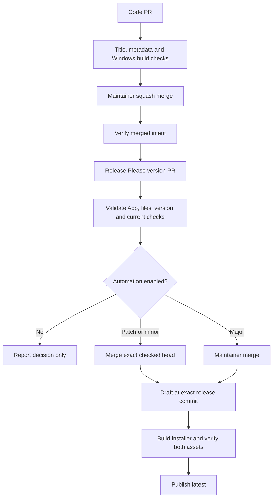

# Contributing and releasing

Use a single-line PR title such as `fix: preserve mute state`, `feat(audio): add a channel`, or `feat!: change the settings format`. Types are lowercase. Allowed types: `feat`, `fix`, `perf`, `docs`, `chore`, `ci`, `build`, `test`, `refactor`, `style`, `revert`.

`fix` and `perf` request a patch, `feat` requests a minor, and `!` requests a major. Maintenance changes do not independently request a release. Keep squash messages consistent with the PR title, with an empty body. Hidden `BREAKING CHANGE` and `Release-As` directives are rejected.

`VERSION` is the application and installer version source. Release Please updates it together with `CHANGELOG.md` and `.release-please-manifest.json`. Do not manually push release tags. The updater requires `win-mix-Setup-{version}-x64.exe` and the release API's SHA-256 digest. The pipeline also publishes the `.exe.sha256` sidecar.

## Repository setup

Install the private release App only on this repository. Give it Contents, Pull requests and Issues write, Metadata read and Variables read. Do not grant administration, workflow write or a ruleset bypass. Store its key as `RELEASE_APP_PRIVATE_KEY`. Set `RELEASE_APP_ID`, `RELEASE_BOT_APP_ID`, `RELEASE_BOT_LOGIN` and `RELEASE_BOT_USER_ID` to its verified identity. The user ID is the numeric `user.id` of a PR created by the App, not the App ID. Read-only PR checks pin that ID, login and Bot type because GitHub prevents their token from looking up a private App. Privileged merge and publication workflows also verify the App ID through its own token. Tokens are short lived and scoped to this repository. Check reads use the workflow's separate read-only token.

Set `RELEASE_POLICY_START_SHA` to the setup merge after auditing earlier unreleased commits. Automation requires complete PR associations and ancestry from the later of that commit and the latest published release. Drafts do not advance the audit boundary. A mismatch requires a maintainer investigation. Automation never rewrites history or skips an offending commit.

Protect `main` with required PRs and the checks `PR title`, `Windows build`, and `Release metadata`, requiring an up-to-date branch. Require no extra approval for solo maintenance. Allow squash only, PR-title commit subjects, blank bodies, and no bypass actors, force pushes or deletion.

## Pause and recovery

`RELEASE_AUTOMATION_ENABLED` must equal `true` to permit automatic release merging or publication. Missing means paused. The initial rollout leaves it `false`. PR preparation still runs. The App can read this variable but cannot change it.

After a separate activation decision, enable the variable and manually run **Release automation** on `main`. **Release PR decision** rechecks current identity, files, version, merge candidate and successful checks before merging a patch or minor. Major versions always require a manual merge.

Release workflows share one concurrency group and never cancel an active publication. Any draft blocks another automatic release merge. Rerun **Release automation** to recover an interrupted draft upload. It resolves the draft and tag through GitHub APIs and only accepts existing assets with matching names, sizes and SHA-256 digests. Conflicting assets or commit SHAs stop recovery. Published assets are never overwritten.

## Verification

Run `node --test Tests/*.test.cjs`, `./Tests/ReleaseChecks.ps1`, `./Tests/DefenderChecks.ps1`, the installer shutdown checks described in CONTRIBUTING.md, and `./build.ps1` on Windows with the pinned .NET SDK and Inno Setup. Both the published application tree and final installer must pass Defender scans before a checksum and success evidence are written. CI retains only the installer and checksum as the `installer` artifact, preserving the two-asset publication contract. The separate `defender-evidence` artifact retains hashes, scanner/signature versions, and raw scan output, including failed scans when available. Policy tests use isolated fake GitHub responses and do not merge or publish.

Before approving a release, test that exact CI installer hash on Windows 10 and 11 with real-time/cloud protection enabled and no effective exclusions. Verify fresh installation, controls, a healthy update and repair of a stopped damaged installation, with settings and startup preference preserved. Do not substitute a locally rebuilt installer for the tested artifact. After authorized publication, compare the hosted asset hash and complete a real Settings update from a clean prior release. Record any unavailable environment or incomplete test as a remaining gate.

Dry-run readiness is distinct from live rollout. Automatic merging and public publication require a later explicitly enabled end-to-end run.
